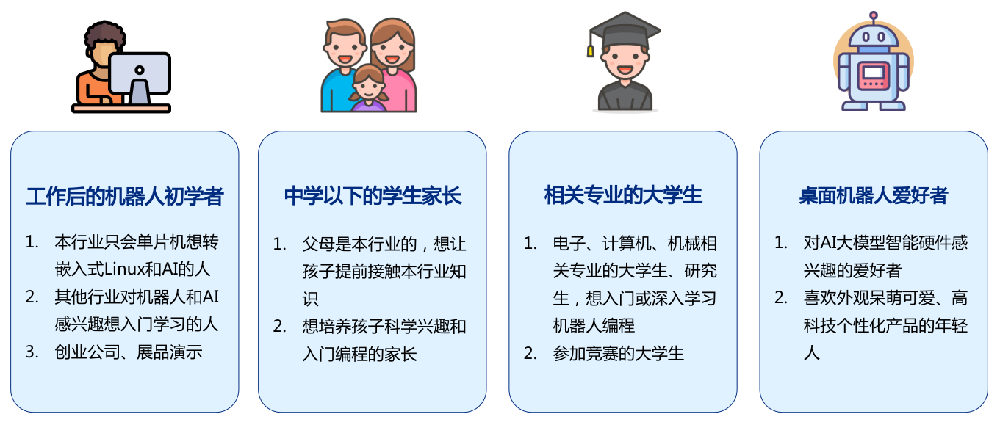
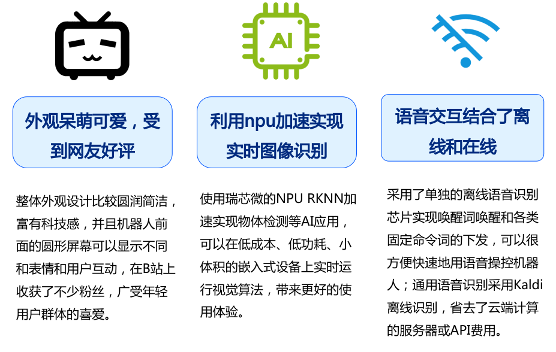

# 购买链接

淘宝：[萤火虫创想 https://shop168302802.taobao.com](https://shop168302802.taobao.com) 

# 项目主页

[https://newbot.readthedocs.io](https://newbot.readthedocs.io)

备用地址：[https://gitee.com/cv-robot/newbot/tree/master/readthedocs](https://gitee.com/cv-robot/newbot/tree/master/readthedocs)

# 嘉立创硬件开源

[https://oshwhub.com/lw95/newbot](https://oshwhub.com/lw95/newbot)

# gitee软件开源

[https://gitee.com/cv-robot/newbot](https://gitee.com/cv-robot/newbot)

# B站视频链接

[【开源】如何手工打造一台理想中的机器人？](https://www.bilibili.com/video/BV1LWUYYjEUg)

[电饭锅们出来军训了ʕ ᵔᴥᵔ ʔ](https://www.bilibili.com/video/BV1TTDBYnE8H)

# 什么是小白机器人

小白机器人是一款集语音交互、图像识别和移动导航于一身的先进人工智能机器人

它不仅是学习和娱乐的理想伙伴，更是探索大模型技术、计算机视觉和ROS机器人编程的绝佳工具

所有代码完全开源，用户可以自由进行DIY和二次开发，实现个性化定制

如果您对编程不熟悉，也无需担心，小白机器人开机即可轻松使用，成为您的智能贴心玩伴

不论是科技爱好者还是编程小白，小白机器人都能带给您无尽的学习机会和乐趣

# 产品外观

# 适用人群

# 市面产品问题

# 本产品亮点

# 硬件规格

|     项目     |                    参数                    |
| :----------: | :----------------------------------------: |
|   产品型号   |                 newbot1.0                  |
|  主芯片SOC   |              Rockchip RK3566               |
|     CPU      |         四核64位Cortex-A55 1.8GHz          |
|     NPU      | 1T算力 支持TensorFlow/ONNX/PyTorch模型转换 |
|     VPU      |         H.264/H.265/JPEG硬件编解码         |
|     RAM      |                 LPDDR4 2GB                 |
|     ROM      |                 eMMC 32GB                  |
|  Wi-Fi+蓝牙  |               Wi-Fi 5+BT 5.0               |
| 控制芯片MCU  |               STM32F103C8T6                |
|   电池容量   |          两节18650共7000mAh 3.7V           |
|  机器人尺寸  |            直径12cm 高度约10cm             |
| 摄像头分辨率 |               1280x800 30FPS               |
|   屏幕尺寸   |             1.28寸SPI圆形屏幕              |
|   操作系统   |                Ubuntu20.04                 |
|   ROS版本    |                ROS1 Noetic                 |

# 硬件框图

# 主要软件功能

# 产品功能概览

## 系统功能

超长续航，待机时间实测7小时以上

内置电池和USB供电自动切换电路，支持在线USB C口充电

支持充电、断开、低电量语音提示

STM32采用串口和SOC主板通信

STM32可通过MOS管控制雷达电源通断

STM32预留IIC和PWM接口

控制板集成了功放电路播放音乐

SOC主板集成了32GB EMMC存储器，比SD卡速度更快

SOC主板集成高速5GHz WIFI，适用于实时流畅传输图像

内置风扇散热，温度过高会自动打开，温度阈值可调

支持二维码分享WIFI密码配网

支持使用脚本一键安装和配置开放板所有环境

## 传感器功能

内置离线语音芯片用于识别唤醒词和命令词

圆形液晶屏可显示互动表情和文字

圆形液晶屏可显示摄像头画面或其他图片

用户可以任意DIY液晶屏显示内容

支持设置机器人眼睛颜色

激光雷达可实时获取平面内360度所有障碍物距离

支持控制雷达打开和关闭

支持通过语音命令控制机器人移动和旋转

支持显示机器人状态，如温度、电压等参数

支持RIVZ可视化机器人3D模型和位置姿态

## 控制功能

PWM信号控制电机油门

编码器反馈电机转速

采用PID算法控制车轮转速

采用PID算法控制车体运动距离和旋转角度

## 大模型功能

可以用于研究学习大语言模型和人机交互

支持Kaldi免费离线语音识别

支持Espeak、Kaldi免费离线TTS和三大免费在线TTS

支持Sqlite数据库缓存TTS数据

支持Spark Lite免费大模型API

支持文生图和图生文大模型

支持在线推荐和播放歌曲

可部署Qwen等轻量级离线大语言模型

支持询问当前时间和天气预报

## 视觉功能

可以用于研究学习计算机视觉和深度学习网络

内置高帧率、低延迟、超广角摄像头

支持JPEG硬解码、JPEG硬编码、图像硬缩放

支持拍照和通过邮件发送照片

支持镜子模式实时显示摄像头画面

内置优化和部署的YOLO目标检测模型

可转换部署RKNN模型实时处理各类视觉任务

支持人体检测和跟踪

支持广角相机鱼眼矫正

## 定位导航功能

可以用于研究学习SLAM、机器人定位导航

支持ROS中的激光SLAM功能包

支持加载地图和AMCL定位

支持DWA或TEB路径规划算法

## APP功能

APP支持显示电压、电量和充电信息

APP支持摇杆操控机器人运动

APP支持实时显示原图和检测图

APP支持显示雷达点云、栅格地图

APP支持在雷达图中发布目标点

APP支持打印任意话题

APP支持按钮发布BOOL话题

APP支持SSH远程连接

# 发货清单

小白机器人本体

十字螺丝刀 + ST-LINK烧录器 + 串口模块

**资料内容如下：**

本在线产品资料（https://newbot.readthedocs.io/）

ROS应用程序源码 + STM32源码 + 离线语音芯片源码

控制板原理图

安卓APP安装包

提供免费技术支持和售后维护

# 注意事项

本产品属于开源学习套件，外壳采用光固化3D打印，存在少量瑕疵，介意者请勿拍

