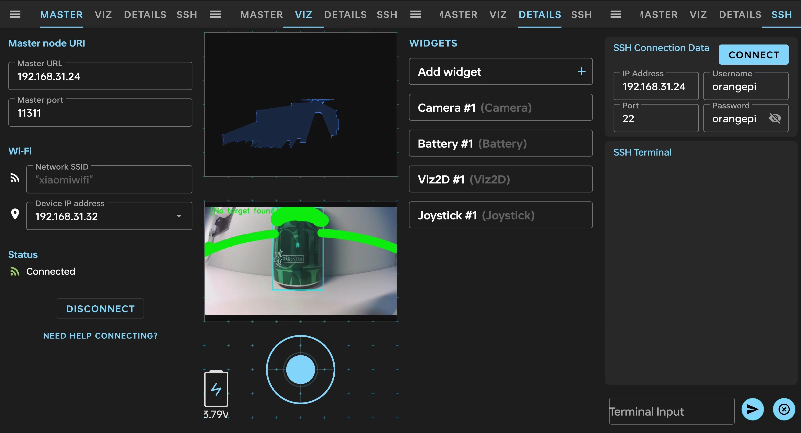
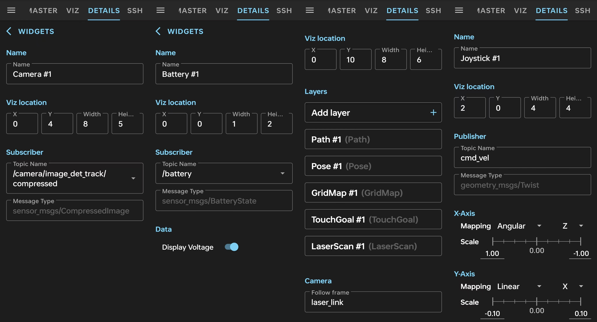
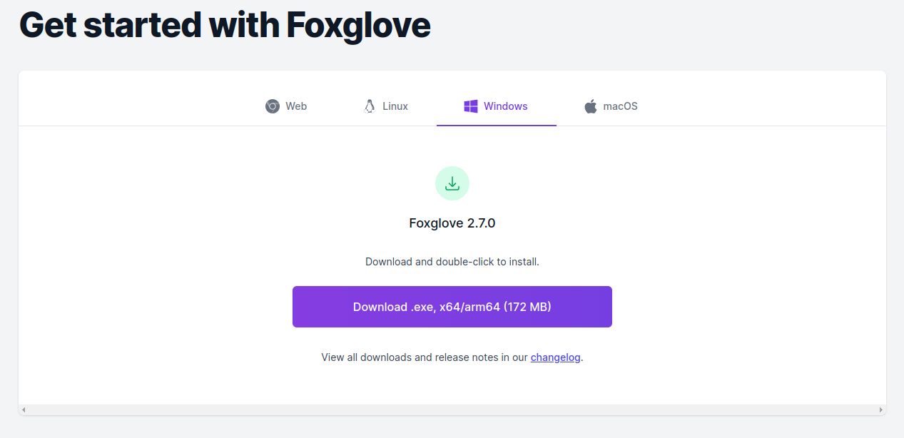

# 一、快速开始

## 1.开机（按底部黑色按钮）

**按一下机器人底部的黑色按钮开机，等待开机完成**。

开机后的现象如下，如果不关心启动过程，可以忽略以下步骤：

1.按一下机器人底部的黑色按钮，大概等待十几秒，会听到扬声器播放“已开机”；

2.如果首次启动，扬声器播放“已打开热点，启动后请说扫一扫开始配网”；如果之前连接过WIFI，扬声器播放“已连接WIFI”；

3.扬声器播放“小白正在启动，请稍等”，继续等待大约十几秒，会在屏幕显示出表情动画；

4.扬声器播放并且屏幕显示“主人您好，请说小白你好唤醒我，请说小白小白和我对话”，表示小白启动完成。

## 2.首次配网（向小白说扫一扫）

**向小白说“小白你好”，然后说“扫一扫”，打开手机的分享二维码界面，对着摄像头扫码即可配网。**

详细步骤如下：

1.在小白启动完成之后，大声说“小白你好”，小白回复“小白已唤醒”；

2.大声说“扫一扫”、“扫描二维码”或者“连接网络”，小白回复“请打开手机设置中的分享WIFI二维码界面，将手机屏幕对着摄像头扫码”，并且屏幕会显示摄像头拍摄的实时画面；

3.打开手机的设置>WLAN>点击家里的WIFI名称>点击分享二维码（每个品牌的手机操作略有不同）

**注意：如果您的手机没有用二维码分享WIFI密码的功能，请看如下步骤：**

可以在百度或者bing搜索WIFI二维码生成，或者直接使用这个WIFI二维码生成网站：

 [WIFI二维码生成工具 https://uutool.cn/wifi-qrcode](https://uutool.cn/wifi-qrcode) 

按照网页上的提示手动输入WIFI名称，WIFI密码，加密方式（如果有密码则选择WPA/WPA2）等选项，然后点击生成二维码；

4.将小白机器人的摄像头对准显示了WIFI二维码的手机界面，听到“叮”的一声之后表示扫码成功，然后扬声器播放“开始连接网络，请稍等……”，等待几秒种后扬声器播放“已连接到网络：xxxx，开始重启”；

5.等待小白机器人重启完成。

## 3.如何判断配网成功（向小白说显示IP地址）

小白重启成功后，向小白说“小白你好”，然后说“读取IP地址"、“获取IP地址”或者“显示IP地址”可查看WIFI名称和IP地址：

小白机器人如果播放“WIFI名称：orangepi 地址：192.168.12.1”，表示还是处于热点模式，配网失败，请重复以上首次配网步骤；

小白机器人如果播放”WIFI名称：家里的WIFI名字 地址：192.168.xx.xx“，表示已经连上家庭WIFI，配网成功。

## 4.解除配网（向小白说忘记网络）

如果想换个路由器连接，或者修改了路由器配置，或者想进入热点模式，可以按照如下方法解除并重新配网。

向小白说“忘记网络"、“删除网络”或者“断开网络”，小白机器人会删除机器人存储的所有WIFI密码，然后重新启动进入热点模式。

在热点模式下，除了大模型对话等要联网的功能之外，其他功能可以正常使用，在户外会自动进入热点模式使用。

如果想再次联网，请重复以上首次配网步骤。


# 二、离线语音命令

小白机器人使用启英泰伦的离线语音芯片进行唤醒词和命令词的识别，提供源码（联系客服提供代码资料）可供您任意修改。

向小白说“小白你好”，在1分钟之内（小白退出唤醒之前），无需再次说任何唤醒词，直接用下面的命令词触发不同的功能：

```shell
wakeup_uni=小白你好@小白已唤醒
chatgpt=小白小白@我在
ip_address=读取哀批地址|获取哀批地址|显示哀批地址@开始读取哀批地址
scan=扫一扫|扫描二维码|连接网络@开始扫一扫
forget_wifi_con=忘记网络|删除网络|断开网络@开始忘记网络
stop=停止@已停止
forward_2=前进两厘米|前进零点零二米@开始前进两厘米
backward_2=后退两厘米|后退零点零二米@开始后退两厘米
forward_5=前进五厘米|前进零点零五米@开始前进五厘米
backward_5=后退五厘米|后退零点零五米@开始后退五厘米
forward_10=前进十厘米|前进零点一米@开始前进十厘米
backward_10=后退十厘米|后退零点一米@开始后退十厘米
forward_20=前进二十厘米|前进零点二米@开始前进二十厘米
backward_20=后退二十厘米|后退零点二米@开始后退二十厘米
forward_30=前进三十厘米|前进零点三米@开始前进三十厘米
backward_30=后退三十厘米|后退零点三米@开始后退三十厘米
forward_50=前进五十厘米|前进零点五米@开始前进五十厘米
backward_50=后退五十厘米|后退零点五米@开始后退五十厘米
forward_100=前进一百厘米|前进一米@开始前进一米
backward_100=后退一百厘米|后退一米@开始后退一米
left_5=左转五度@开始左转五度
right_5=右转五度@开始右转五度
left_10=左转十度@开始左转十度
right_10=右转十度@开始右转十度
left_20=左转二十度@开始左转二十度
right_20=右转二十度@开始右转二十度
left_30=左转三十度@开始左转三十度
right_30=右转三十度@开始右转三十度
left_45=左转四十五度@开始左转四十五度
right_45=右转四十五度@开始右转四十五度
left_90=左转九十度@开始左转九十度
right_90=右转九十度@开始右转九十度
left_180=左转一百八十度@开始左转一百八十度
right_180=右转一百八十度@开始右转一百八十度
left_360=左转三百六十度@开始左转三百六十度
right_360=右转三百六十度@开始右转三百六十度
voice_up=音量调大|调大音量|增大音量|声音大点@音量已调大
voice_down=音量调小|调小音量|减小音量|声音小点@音量已调小
sing=唱歌|唱首歌@开始唱歌
dance=跳舞|跳个舞@开始跳舞
smile=微笑@哈哈哈
charge=回去充电@开始回去充电
good_night=睡觉|晚安@晚安
good_morning=早上好|早安@早安
photo=拍照|拍张照@三,二,一
tracking_person=跟着我|跟我走@开始跟着你
cancel_tracking=取消跟踪@已取消跟踪
high_lidar=雷达加速|雷达高速@雷达已进入高速模式
medium_lidar=打开雷达|雷达打开|雷达中速@雷达已打开
low_lidar=雷达减速|雷达低速@雷达已进入低速模式
off_lidar=雷达关闭|关闭雷达@雷达已关闭
reboot=重启@开始重启
mirror_mode=镜子模式|显示图像@开始镜子模式
dis_state_mode=显示状态模式|显示机器人状态@开始显示状态模式
quit=退出|取消@已退出
wakeup_exit=退下@有需要再叫我
cur_time=现在几点了|现在时间|当前时间@开始查询时间
weather=今天天气怎么样|今天天气|天气预报@开始查询天气
sound=打开声音|退出静音@已退出静音模式
mute=关闭声音|静音模式@已进入静音模式
open_lcd=打开屏幕@已打开屏幕
close_lcd=关闭屏幕@已关闭屏幕
```


# 三、大语言模型

## 1.大模型聊天

向小白机器人说“小白小白”，听到“叮”的一声，开始说出你想问的问题，小白的眼睛变成绿色表示处于录音状态。

听到“咚”的一声表示小白机器人检测到了对话结束，停止录音，进入语音识别和大模型回复阶段。

如果小白机器人回复“我什么也没有听到，请大声和我对话”，表示说话声音过小，或者麦克风及其配置出现故障。

如果小白机器人回复”这个问题我还不知道呢“，表示网络连接有问题，确保家里的WIFI可以正常上网，并且按照上面的首次配网步骤成功配网。

默认使用科大迅飞spark lite大模型，免费无限次调用。

## 2.文生图

在说“小白小白”开启对话之后，如果您的聊天对话中出现“画”这个关键字，小白机器人会在屏幕上完成一幅画。

默认使用科大迅飞大模型，在试用结束后可能会无法使用，需要自己去迅飞控制台申请试用套餐的API密钥写入程序。

## 3.图生文

在说“小白小白”开启对话之后，如果您的聊天对话中出现“看”这个关键字，小白机器人会拍摄一张照片，并且描述照片中的内容。

默认使用科大迅飞大模型，在试用结束后可能会无法使用，需要自己去迅飞控制台申请试用套餐的API密钥写入程序。

## 4.在线播放音乐

在说“小白小白”开启对话之后，如果您的聊天对话中出现“唱”这个关键字，小白机器人会更具您的需求推荐一首歌曲在线播放。

## 5.眼睛变成某个颜色

在说“小白小白”开启对话之后，对小白说“眼睛变成红色”，小白的眼睛会变成红色。

目前支持红、绿、蓝、黄、青、紫、随机色。


# 四、目标检测和跟踪

在说“小白你好”唤醒小白之后，向小白说“跟着我”或“跟我走”，小白会进入目标跟踪模式。

向小白说“打开雷达”，雷达会开始旋转；向小白说“关闭雷达”，雷达会停止旋转。

如果没有打开雷达，小白机器人会跟着你旋转而不会前后移动；

如果打开了雷达，小白机器人会前后移动和旋转，和你保持30厘米跟踪距离。

向小白说“取消跟踪”或者“停止”，小白则不会再跟着你。


# 五、手机APP连接

1.安卓手机安装ROS Mobile APP（联系客服提供代码资料）；

2.打开APP界面如下图的截图1（假设以下截图从左到右依次编号为1，2，3，4），在MASTER界面中填写小白机器人的IP地址（向小白说显示IP地址获取），确保手机和小白机器人连接了同一个WIFI，然后点击CONNECT按钮，如下图的截图1显示绿色标志Connected表示成功连接机器人；

3.点击DETAILS选项卡，如下图的截图3进行界面控件的设置，点击Add widget按钮添加Camera、Battery、Viz2D、Joystick四个控件；



4.添加Camera图像控件，如下图的截图1，显示位置和尺寸分别为0，4，8，5，选择想要显示的图像话题；

5.添加Battery电池控件，如下图的截图2，显示位置和尺寸分别为0，0，1，2，选择电池信息话题为/battery，并且勾选显示电压；

6.添加Viz2D雷达控件，如下图的截图3，显示位置和尺寸分别为0，10，8，6，选择显示不同的图层，并且frame设置为laser_link；

7.添加Joystick手柄控件，如下图的截图4，显示位置和尺寸分别为2，0，4，4，设置发布话题为cmd_vel，并且设置最大速度如下图；

8.点击VIZ选项卡，如上图的截图2，可以看到图像画面，如果雷达开启可以看到雷达点云，左下角显示了电池电压和充电状态信息，前后左右拖动手柄，可以观察到机器人的运动；

9.如果想通过ssh远程访问机器人，可以点击SSH选项卡，如上图的截图4，填写机器人IP地址，用户名和密码都是orangepi，点击CONNECT按钮连接，如果连接成功可以在左下角输入Linux命令远程操作。




# 六、电脑端连接

在Windows、Ubuntu或者macOS系统下，可以通过安装ROS1与机器人多机通信，也可以下载客户端FoxgloveStudio远程连接机器人。

 [FoxgloveStudio下载 https://foxglove.dev/download](https://foxglove.dev/download) 



