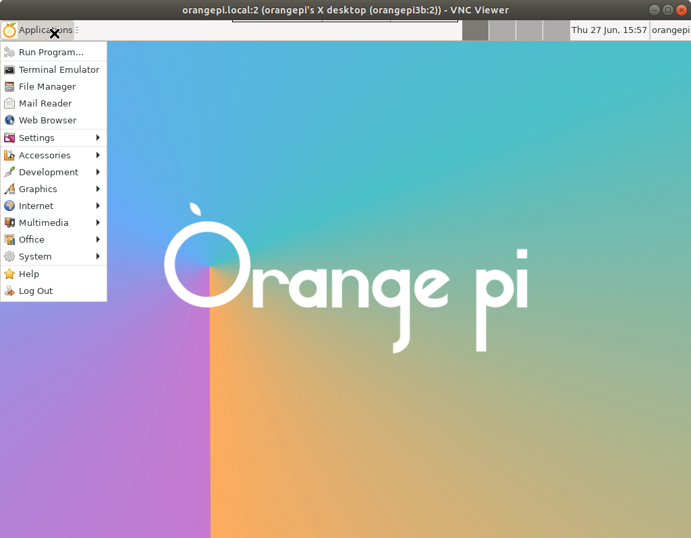

# 一、通过命令行远程登录机器人

**（为了区分电脑上执行的命令还是远程登录开发板之后执行的命令，在电脑命令前面加了美元符号作为标记，实际不要输入美元符号）**

1.先保证电脑和小白机器人连接了同一个wifi，或者小白机器人处于热点模式，电脑连接了小白机器人的热点orangepi；

2.在唤醒状态下，向小白机器人说“显示IP地址”，小白机器人屏幕会显示出当前IP地址；

3.在windows或者ubuntu系统（推荐使用ubuntu系统开发）的电脑上打开终端输入：

```shell
$ ssh orangepi@192.168.xx.xx
```

如果是热点模式则输入：

```shell
$ ssh orangepi@192.168.12.1
```

也可以直接执行：

```shell
$ ssh orangepi@orangepi.local
```

如果出现known_hosts报错，按照提示解决或删除对应文件.ssh/known_hosts即可

如果出现yes/no提示，请输入yes

4.根据提示输入ssh密码：

```shell
$ orangepi
```

5.成功进入机器人系统终端，可以远程执行Linux命令。


# 二、关闭开机自启的ROS应用程序

在登录机器人之后，如果想要手动执行ROS程序，但是默认开机会自动启动ROS程序，需要先关闭当前的ROS程序，选择如下两个命令中的一个执行或者都执行：

```shell
rosnode kill -a #关闭所有节点，但不关闭roscore
killall rosmaster #关闭roscore并且所有节点也会跟着关闭
```

执行结束之后，机器人眼睛不再眨眼，说明当前的ROS程序已经被关闭。


# 三、手动执行ROS应用程序

在关闭开机启动的ROS程序之后，进入板子主目录下的newbot_ws目录（如果板子重新刷机或者系统丢失，联系客服提供代码资料），执行如下命令手动启动ROS程序：

```shell
killall rosmaster #一定要先关闭开机启动的ROS程序
cd ~/newbot_ws/
source devel/setup.bash
roslaunch pkg_launch all.launch
```

执行成功后小白机器人会播放提示语，并且屏幕会显示眼睛和眨眼，终端会打印程序日志。


# 四、配置多机通信

开放板上的.bashrc已经提前配置好了，可以在开发板执行cat ~/.bashrc看到配置如下：

```shell
HOST_IP=$(hostname -I | awk '{print $1}')
export ROS_IP=$HOST_IP
export ROS_HOSTNAME=$HOST_IP
export ROS_MASTER_URI=http://$HOST_IP:11311
#以下环境变量三选一
export LIDAR_TYPE=YDLIDAR    #雷达顶部有两颗螺丝
export LIDAR_TYPE=M1C1_MINI  #雷达顶部有三颗螺丝
export LIDAR_TYPE=M1C1_MINI_TTYUSB #雷达顶部有三颗螺丝，但是数据线接到USB接口的（目前发售的没有这款）
```

电脑上需要配置多机通信，编辑电脑上的~/.bashrc文件：

```shell
$ gedit ~/.bashrc #编辑~/.bashrc文件，增加内容如下：
HOST_IP=$(hostname -I | awk '{print $1}')
export ROS_IP=$HOST_IP
export ROS_HOSTNAME=$HOST_IP
#export ROS_MASTER_URI=http://$HOST_IP:11311 #关闭多机通信
export ROS_MASTER_URI=http://orangepi.local:11311 #开启多机通信(也可以把orangepi.local直接替换为板子IP地址)
```


# 五、安装和挂载NFS

NFS服务可以让电脑和开发板共享文件，实际上是存放在电脑上的，避免因为开发板崩溃导致正在开发中的代码丢失。

除了安装NFS服务共享文件，也可以直接通过scp命令将修改后的代码传输到开发板的~/newbot_ws编译和运行，根据每个人的习惯选择不同的开发方案。

## 电脑作为服务端

ubuntu电脑上执行如下命令，开启NFS服务，windows系统可以查询具体对应的方法。

```shell
$ sudo apt install nfs-kernel-server
$ sudo gedit /etc/exports
末尾增加一行：/home/xxx/workspace/nfs *(rw,sync,no_root_squash) #根据自己为电脑定义的nfs路径修改
$ showmount -e localhost
```

## 板子作为客户端

```shell
ssh orangepi@板子ip地址
sudo apt update
sudo apt install nfs-common
mkdir ~/nfs
sudo mount -t nfs -o nolock 192.168.xx.xx:/home/xxxx/xxxx/nfs ~/nfs
#这里修改为自己电脑的IP地址和NFS共享目录，例如：
sudo mount -t nfs -o nolock 192.168.1.142:/home/xxx/workspace/nfs ~/nfs
```

挂载成功后，在板子上运行如下命令可以将板子上的代码拷贝到电脑上修改，或者直接用资料中提供的代码放在电脑NFS目录中：

```shell
cp -rv ~/newbot_ws ~/nfs/newbot/newbot_ws #修改为自己电脑NFS共享目录
```


# 六、编译ROS代码

代码开发过程可以在NFS共享目录中编译，最终部署到~/newbot_ws目录编译，开机会自动启动~/newbot_ws中的代码。

```shell
cd ~/nfs/xxx/newbot_ws #如果编译NFS共享目录里的开发代码，则进入~/nfs/xxx/newbot_ws目录
#cd ~/newbot_ws           #如果是编译本地的部署代码，则进入~/newbot_ws目录
killall rosmaster #编译之前要关闭ROS程序，防止内存不够用(c++: fatal error: Killed signal terminated program cc1plus)
catkin_make #如果内存还是不够编译的时候输入catkin_make -j1或catkin_make -j2
```


# 七、如何使用远程桌面

## 1.tightvnc

在开发板上输入vncserver启动VNC服务：

```shell
vncserver #输入该命令会打印如下log

You will require a password to access your desktops.

Password: #提示输入远程密码例如:orangpi
Verify:   #确认输入远程密码例如:orangpi
Would you like to enter a view-only password (y/n)? n #输入n

New 'X' desktop is orangepi3b:1

Creating default startup script /home/orangepi/.vnc/xstartup
Starting applications specified in /home/orangepi/.vnc/xstartup
Log file is /home/orangepi/.vnc/orangepi3b:1.log
```

此时在电脑上下载VNC Viewer客户端，输入ip地址:1或者orangepi.local:1远程连接开发板桌面，会显示灰屏。

开放板上输入如下指令，解决灰屏问题：

```shell
sudo apt install -y openbox

vim ~/.vnc/xstartup #编辑xstartup文件，删除所有内容，新增内容如下：

#!/bin/bash
unset SESSION_MANAGER
unset DBUS_SESSION_BUS_ADDRESS
[ -r $HOME/.Xresources ] && xrdb $HOME/.Xresources
startxfce4 &
openbox-session &

#编辑~/.vnc/xstartup完成后再次启动vncsever
sudo chmod +x xstartup #添加xstartup的执行权限
vncserver #会打印如下log

New 'X' desktop is orangepi3b:2

Starting applications specified in /home/orangepi/.vnc/xstartup
Log file is /home/orangepi/.vnc/orangepi3b:2.log
```

在电脑上启动VNC Viewer客户端，输入ip地址:2或者orangepi.local:2远程连接开发板桌面，并且输入刚才设置好的远程密码，打开后在电脑上看到如下界面，说明远程桌面配置成功。



## 2.x11vnc

安装方法：

```shell
sudo apt install x11vnc
x11vnc -storepasswd #创建连接密码，密码默认保存在/home/xxx/.vnc/passwd文件中
#打开远程桌面：
export DISPLAY=:0
#x11vnc -auth guess -once -loop -noxdamage -repeat -rfbauth /home/xxx/.vnc/passwd -rfbport 5900 -shared
#对于香橙派来说，上述命令修改为：
x11vnc -auth guess -once -loop -noxdamage -repeat -rfbauth /home/orangepi/.vnc/passwd -rfbport 5900 -shared
```

设置开机自启：

```shell
sudo vim /etc/systemd/system/x11vnc.service #修改该文件内容如下：

[Unit]
Description=x11vnc (Remote access)
After=network-online.target

[Service]
Type=simple
ExecStart=/usr/bin/x11vnc -auth guess -display :0 -rfbauth /home/orangepi/.vnc/passwd -rfbport 5900 -forever -loop -noxdamage -repeat -shared -capslock -nomodtweak
ExecStop=/bin/kill -TERM $MAINPID
ExecReload=/bin/kill -HUP $MAINPID
KillMode=control-group
Restart=on-failure

[Install]
WantedBy=graphical.target

#文件创建成功以后，使用以下命令重新读取系统服务配置，将x11vnc.service加入系统服务并开启
sudo systemctl daemon-reload
sudo systemctl enable x11vnc
sudo systemctl start x11vnc
```

## 3.使用向日葵arm版或者todesk arm版本

向日葵下载地址：

https://sunlogin.oray.com/download/linux?type=personal&ici=sunlogin_navigation

todesk下载地址：

https://www.todesk.com/linux.html

**注意：一定要下载安装arm64版本**


# 八、建图和导航测试

在开启了all.launch的情况下，另外打开一个终端，通过如下命令测试建图和导航效果。

**注意：在测试建图之前需要把雷达调整到中速度或高速模式，离线语音命令为“雷达中速”、“雷达高速度”。**

```shell
cd ~/newbot_ws
source devel/setup.bash 

roslaunch robot_navigation blank_map_move_base.launch #空地图下测试路径规划(map坐标系和odom坐标系永远一致)

#先让雷达进入高速模式
roslaunch robot_navigation robot_slam.launch #SLAM建图测试

cd maps && rosrun map_server map_saver -f map #进入robot_navigation包里的maps目录，执行map_server保存地图

roslaunch robot_navigation robot_navigation.launch #加载上一部保存的地图、定位和路径规划测试
```

电脑上可视化建图和导航效果：

```shell
$ rviz #在电脑上执行，打开pkg_launch/rviz/robot.rviz文件可视化建图和导航结果
```

直接在电脑输入rviz然后打开robot.rviz文件会引起警告：Could not load resource [package://newbot_urdf/meshes/...，无法显示出机器人模型，其他功能正常。

或者将newbot_ws在电脑上复制一份例如命名为newbot_ws_x86在电脑上编译一份电脑版：

```shell
$ cd newbot_ws_x86
$ rm -r build devel
$ catkin_make --pkg ai_msgs && catkin_make
$ source devel/setup.bash
$ roslaunch pkg_launch rviz.launch #可视化建图和导航效果，并且能看到小白机器人的模型可视化
```


# 九、重刷系统

目前默认镜像：Orangepi3b_1.0.6_ubuntu_focal_desktop_xfce_linux5.10.160.7z    1.1G    2024-04-25 10:33

镜像下载地址：https://pan.baidu.com/share/init?surl=J_chiuD5biO6LD9qVKSV1Q&pwd=eexj

香橙派官网资料下载地址：[香橙派3B资料下载](http://www.orangepi.cn/html/hardWare/computerAndMicrocontrollers/service-and-support/Orange-Pi-3B.html)

可以根据香橙派3B官方的用户手册pdf重刷系统。


# 十、一键部署所有环境和代码

如果重新刷机或者操作系统无法启动要重新刷机，刷机之后可以用以下脚本和代码恢复所有环境：

```shell
vim install.sh  #把下面的脚本内容复制粘贴到install.sh文件里保存并执行
bash install.sh #此脚本在newbot_ws/src/config目录下也存放了一份
```

install.sh内容如下，需要根据注释中的注意事项做一定的修改（联系客服提供代码资料）：

```shell
#!/bin/bash
#1.安装和挂载NFS
sudo apt update
sudo apt install -y nfs-common avahi-daemon
mkdir ~/nfs
#注意事项：这里修改为自己电脑的IP地址和NFS路径
#sudo mount -t nfs -o nolock 192.168.xx.xx:/home/xxxx/xxxx/nfs ~/nfs
sudo mount -t nfs -o nolock 192.168.1.142:/home/luowei/workspace/nfs ~/nfs

#2.配置avahi-daemon服务
#注意事项：一个局域网不能同时有多个orangepi.local设备
sudo sed -i 's/#host-name=foo/host-name=orangepi/' /etc/avahi/avahi-daemon.conf
sudo service avahi-daemon restart

#3.安装和配置ROS
#sudo sh -c 'echo "deb http://packages.ros.org/ros/ubuntu $(lsb_release -sc) main" > /etc/apt/sources.list.d/ros-latest.list' #官方源网速较慢
sudo sh -c 'echo "deb http://mirrors.ustc.edu.cn/ros/ubuntu $(lsb_release -sc) main" > /etc/apt/sources.list.d/ros-latest.list' #中科大源
sudo apt-key adv --keyserver 'hkp://keyserver.ubuntu.com:80' --recv-key C1CF6E31E6BADE8868B172B4F42ED6FBAB17C654
sudo apt update
#安装ros完整版，等待数分钟完成
sudo apt install -y ros-noetic-desktop-full

if ! grep -q "source /opt/ros/noetic/setup.bash" ~/.bashrc; then
	echo "source /opt/ros/noetic/setup.bash" >> ~/.bashrc
fi
if ! grep -q "HOST_IP=\$(hostname -I | awk '{print \$1}')" ~/.bashrc; then
	echo "HOST_IP=\$(hostname -I | awk '{print \$1}')" >> ~/.bashrc
fi
if ! grep -q "export ROS_IP=\$HOST_IP" ~/.bashrc; then
	echo "export ROS_IP=\$HOST_IP" >> ~/.bashrc
fi
if ! grep -q "export ROS_HOSTNAME=\$HOST_IP" ~/.bashrc; then
	echo "export ROS_HOSTNAME=\$HOST_IP" >> ~/.bashrc
fi
if ! grep -q "export ROS_MASTER_URI=http://\$HOST_IP:11311" ~/.bashrc; then
	echo "export ROS_MASTER_URI=http://\$HOST_IP:11311" >> ~/.bashrc
fi
#注意事项：这里如果雷达顶部有两颗螺丝，则写入YDLIDAR；如果雷达顶部有三颗螺丝，则写入M1C1_MINI
#这个配置要在start.sh中也要配置一遍，并且配置要一致
#要么写入YDLIDAR
#if ! grep -q "export LIDAR_TYPE=YDLIDAR" ~/.bashrc; then
#	echo "export LIDAR_TYPE=YDLIDAR" >> ~/.bashrc
#fi
#要么写入M1C1_MINI
if ! grep -q "export LIDAR_TYPE=M1C1_MINI" ~/.bashrc; then
	echo "export LIDAR_TYPE=M1C1_MINI" >> ~/.bashrc
fi

source ~/.bashrc

#4.安装常用的ROS包
sudo apt install -y ros-noetic-teleop-twist-keyboard ros-noetic-move-base-msgs ros-noetic-move-base ros-noetic-map-server ros-noetic-base-local-planner ros-noetic-dwa-local-planner ros-noetic-teb-local-planner ros-noetic-global-planner ros-noetic-gmapping ros-noetic-amcl libudev-dev

#5.安装EAI YDLidar库
#cd ~/nfs/xxx/newbot_ws/src/lidar_sensors/ydlidar/YDLidar-SDK #注意事项：修改为自己的NFS目录
cd ~/nfs/newbot/newbot_ws_v1.1/newbot_ws/src/lidar_sensors/ydlidar/YDLidar-SDK
#mkdir build 
cd build
#cmake ..
#make -j #注意：如果已经编译过了不用再编译，编译报错需要删除build文件夹和CMakeCache.txt
sudo make install #编译过了只需安装，如果报错需要重新编译
sync #把所有数据从内存缓冲区同步到硬盘

#6.安装常用的python包
export PATH=$PATH:/home/orangepi/.local/bin #防止安装python包时候的WARNING: The script read_zbar is installed in '/home/orangepi/.local/bin' which is not on PATH.
sudo apt install -y python3-pip python3-websocket python3-pyaudio libsox-fmt-mp3 libatlas-base-dev espeak sox #后面几个是音频相关的依赖包
pip config set global.index-url https://pypi.mirrors.ustc.edu.cn/simple
pip install -U pip

pip install opencv-python #这个报错不用管:ERROR: opencv-python 4.10.0.84 has requirement numpy>=1.19.3; but you'll have numpy 1.17.4 which is incompatible.
pip install sherpa_onnx

pip install pulsectl
pip install baidu-aip
pip install edge_tts
pip install pyttsx3
pip install pyzbar

pip install gpio
pip install python-periphery

pip install sounddevice
pip install httpx
pip install pycryptodome #对应代码:from Crypto.Cipher import AES
pip install pytz

#7.配置音频设备和音量
#这两个命令查看默认设备，前面有星号的代表默认：
pacmd list-sinks | grep -e 'index:' -e 'name:'
pacmd list-sources | grep -e 'index:' -e 'name:'
#如果列表里根本没有USB设备，可以尝试重新安装pulseaudio，可能重装两遍才行
sudo apt remove -y pulseaudio
sudo apt install -y pulseaudio
sudo apt remove -y pulseaudio
sudo apt install -y pulseaudio
pacmd list-sinks | grep -e 'index:' -e 'name:'
pacmd list-sources | grep -e 'index:' -e 'name:'
#这个命令配置在重启后可能会变化，加入启动脚本
pactl set-default-sink "alsa_output.platform-rk809-sound.stereo-fallback"
pactl set-default-source "alsa_input.usb-C-Media_Electronics_Inc._USB_PnP_Sound_Device-00.mono-fallback"
pacmd list-sinks | grep -e 'index:' -e 'name:'
pacmd list-sources | grep -e 'index:' -e 'name:'
#设置喇叭音量
pactl set-sink-volume "alsa_output.platform-rk809-sound.stereo-fallback" 100%
#设置USB麦克风的捕获强度，范围0~16
amixer -c 2 sset Mic 16

#8.拷贝应用程序和启动脚本，解压和编译
#cd ~/nfs/xxx #注意事项：修改为自己的NFS目录
cd ~/nfs/newbot/newbot_ws_v1.1
cp -rv newbot_ws.zip ~ #拷贝newbot_ws.zip压缩包到板子根目录，注意提前做好压缩包放在NFS目录中
sudo cp -rv newbot_ws/src/config/rc.local  /etc
sudo cp -rv newbot_ws/src/config/*v2*      /boot/dtb/rockchip
sync #把所有数据从内存缓冲区同步到硬盘

#解压文件
cd ~
rm -r newbot_ws #删除原有程序，注意备份防止误删
unzip newbot_ws.zip
sync #把所有数据从内存缓冲区同步到硬盘

#如果没有正确编译按照如下命令编译
#cd ~/newbot_ws
#source /opt/ros/noetic/setup.bash
#rosnode kill -a
#killall rosmaster #编译之前要关闭ROS程序，防止内存不够用(c++: fatal error: Killed signal terminated program cc1plus)，如果内存还是不够编译的时候输入catkin_make -j1或catkin_make -j2
#rm devel build #如果已经编译正确则不用删除和编译
#catkin_make --pkg ai_msgs && catkin_make
#catkin_make #Cmakelist.txt里面加了add_dependencies(${PROJECT_NAME} ai_msgs_generate_messages_cpp)之后只需直接输入catkin_make，不用先编译ai_msgs
#cp -rv build/ devel/ ~/nfs/newbot/newbot_ws_v1.1/newbot_ws #把结果复制到电脑一份方便烧录下一个板子 #注意事项：修改为自己的NFS目录
#sync #把所有数据从内存缓冲区同步到硬盘

#9.配置SPI3和UART2,9使能，注意：UART2使能之后，串口调试功能会失效，只能通过网络或屏幕连接
if ! grep -q "overlays=spi3-m0-cs0-spidev uart2-m0 uart9-m2" /boot/orangepiEnv.txt; then
    sudo sh -c 'echo "overlays=spi3-m0-cs0-spidev uart2-m0 uart9-m2" >> /boot/orangepiEnv.txt'
fi
#配置完SPI和UART之后要重启生效
#不要直接拔电，可能造成文件拷贝不完整，要用命令行重启，或者用sync将缓存同步到硬盘
sync #把所有数据从内存缓冲区同步到硬盘
reboot

```


# 十一、开机自动启动脚本

在上一步的一键部署过程中默认会自动修改如下脚本，下面给出脚本内容作为参考：

/etc/rc.local内容参考：

```shell
#!/bin/sh -e

create_ap --fix-unmanaged #关闭热点

play /home/orangepi/newbot_ws/src/audio/scripts/sound/boot.mp3

sudo chmod 777 /dev/spidev3.0
sudo chmod 777 /sys/class/gpio/export
echo 128 > /sys/class/gpio/export
echo 130 > /sys/class/gpio/export
sudo chmod 777 /sys/class/gpio/gpio128/value
sudo chmod 777 /sys/class/gpio/gpio128/direction
sudo chmod 777 /sys/class/gpio/gpio130/value
sudo chmod 777 /sys/class/gpio/gpio130/direction
gpio mode 20 out && gpio write 20 0

su - orangepi -c "mkdir -p /home/orangepi/.ros"
su - orangepi -c "cd /home/orangepi/newbot_ws/src/config && bash start.sh > /home/orangepi/.ros/start.log &"

exit 0

```

/home/orangepi/newbot_ws/src/config/start.sh内容参考：

```shell
# 检查是否保存有WIFI连接
wifi_ssid=$(nmcli connection show | grep wifi | awk '{print $1}')
if [ -z "$wifi_ssid" ]; then
    echo "系统没有存储任何WIFI密码"
    #host_ip=$(hostname -I | awk '{print $1}')
    host_ip=$(hostname -I | awk '{print $1}' | grep -E '^[0-9]+\.[0-9]+\.[0-9]+\.[0-9]+') #只采用IPv4地址
else
    echo "系统中保存有WIFI密码"
    # 尝试获取IP地址15秒
    for cnt in $(seq 1 15); do
        #host_ip=$(hostname -I | awk '{print $1}')
        host_ip=$(hostname -I | awk '{print $1}' | grep -E '^[0-9]+\.[0-9]+\.[0-9]+\.[0-9]+') #只采用IPv4地址
        if [ -z "$host_ip" ]; then
            echo "尝试第$cnt次获取IP地址失败，等待1秒后重试"  
            sleep 1
        else
            echo "IP地址已成功获取: $host_ip"
            play /home/orangepi/newbot_ws/src/audio/scripts/sound/sta.mp3
            break
        fi
    done
fi

# 如果IP地址为空，则开启AP模式
if [ -z "$host_ip" ]; then
    echo "开启AP模式..."
    echo "orangepi" | sudo -S create_ap --no-virt -m nat wlan0 eth0 orangepi orangepi &
    host_ip="192.168.12.1"  #AP模式的默认IP地址是192.168.12.1  
    echo "AP模式已开启，IP地址: $host_ip"
    play /home/orangepi/newbot_ws/src/audio/scripts/sound/ap.mp3
fi


export ROS_IP=$host_ip
export ROS_HOSTNAME=$host_ip
export ROS_MASTER_URI=http://$host_ip:11311
#注意事项：这里如果雷达顶部有两颗螺丝，则设置为YDLIDAR；如果雷达顶部有三颗螺丝，则设置为M1C1_MINI
#这个配置要在.bashrc中也要配置一遍，并且配置要一致
#export LIDAR_TYPE=YDLIDAR
export LIDAR_TYPE=M1C1_MINI

source /opt/ros/noetic/setup.sh
source /home/orangepi/newbot_ws/devel/setup.sh
sleep 3 #等待3秒，防止网络不稳定引起的ROS启动错误

#为解决重启后声卡可能丢失的问题，重新打开一下pulseaudio
systemctl --user stop pulseaudio.socket
systemctl --user stop pulseaudio.service
systemctl --user start pulseaudio.socket
systemctl --user start pulseaudio.service

#设置默认的麦克风设备为USB麦克风
pactl set-default-source "alsa_input.usb-C-Media_Electronics_Inc._USB_PnP_Sound_Device-00.mono-fallback"
#麦克风接收增益调到100%，范围0~16
amixer -c 2 sset Mic 16

#启动all.launch
play /home/orangepi/newbot_ws/src/audio/scripts/sound/launch.mp3
roslaunch pkg_launch all.launch #如果启动失败，请查看~/.ros/log/latest/*.log，~/.ros/start.log等log文件

```


# 十二、修改风扇启动的温度阈值

防止风扇频繁启动产生噪音，默认已经将风扇的打开阈值修改为65度，如果需要自定义，通过如下方法修改dtb文件完成：

```shell
cd /boot/dtb/rockchip
#dtb转dts:
sudo dtc -I dtb -O dts -o rk3566-orangepi-3b-v2-edit-fan.dts rk3566-orangepi-3b-v2.dtb
#修改dts:
sudo vim rk3566-orangepi-3b-v2-edit-fan.dts
#备份原始dtb:
sudo mv rk3566-orangepi-3b-v2.dtb rk3566-orangepi-3b-v2-raw.dtb
#生成新的dtb(注意下面的修改操作结束后必须用此命令转换为dtb才会生效):
sudo dtc -I dts -O dtb -o rk3566-orangepi-3b-v2.dtb rk3566-orangepi-3b-v2-edit-fan.dts
#同步到硬盘并重启：
sync
sudo reboot
```

rk3566-orangepi-3b-v2-edit-fan.dts内容修改：

cooling-levels表示pwm占空比：cooling-levels = <0 50 100 150 200 255>

temp-trips表示不同的温度对应的不同档位：rockchip,temp-trips = <50000 1 55000 2 60000 3 65000 4 70000 5>

修改前：

```shell
	pwm-fan {
		compatible = "pwm-fan";
		#cooling-cells = <0x02>;
		pwms = <0x12e 0x00 0xc350 0x00>;
		cooling-levels = <0x00 0x32 0x64 0x96 0xc8 0xff>;
		rockchip,temp-trips = <0xc350 0x01 0xd6d8 0x02 0xea60 0x03 0xfde8 0x04 0x11170 0x05>;
		status = "okay";
		phandle = <0x30a>;
	};
```

修改后：

```shell
	pwm-fan {
		compatible = "pwm-fan";
		#cooling-cells = <0x02>;
		pwms = <0x12e 0x00 0xc350 0x00>;
		cooling-levels = <0x00 0x01 0x01 0x01 0xff 0xff>;
		rockchip,temp-trips = <0xc350 0x01 0xd6d8 0x02 0xea60 0x03 0xfde8 0x04 0x11170 0x05>;
		status = "okay";
		phandle = <0x30a>;
	};
```

如果不用内核驱动自动打开风扇，而是应用层手动控制风扇：

```shell
在rk3566-orangepi-3b-v2-edit-fan.dts搜索pwm-fan，然后修改下面这行，表示关闭风扇驱动：
status = "disabled"

sudo su

cd /sys/class/pwm/pwmchip0
echo 0 > export
cd /sys/devices/platform/fe6e0030.pwm/pwm/pwmchip0/pwm0
chmod 777 period polarity enable duty_cycle
echo 50000 > period
echo normal > polarity
echo 1 > enable
echo 0 > duty_cycle

#以上代码可以写入rc.local
#应用层程序控制风扇
echo 0 > /sys/devices/platform/fe6e0030.pwm/pwm/pwmchip0/pwm0/duty_cycle
echo 50000 > /sys/devices/platform/fe6e0030.pwm/pwm/pwmchip0/pwm0/duty_cycle
#测试发现v2.1版本的香橙派在41000以下根本不会转，还会发出嘶嘶的噪音，所以pwm不要取中间值
```

注意：如果手动控制风扇不合理可能会导致CPU过热死机的情况发生

