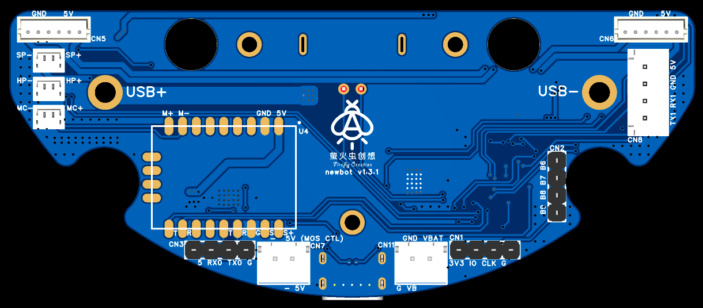

# 一、40Pin接口

| 引脚定义      | 接线定义                        | 引脚定义  | 接线定义                  |
| ------------- | ------------------------------- | --------- | ------------------------- |
| 3.3V          |                                 | 5V        |                           |
| SDA.2         |                                 | **5V**    | 5V 红色（香橙派电源）     |
| SCL.2         |                                 | **GND**   | GND 黑色（香橙派地线）    |
| PWM15         |                                 | **TXD.2** | RX1红色（香橙派串口发送） |
| GND           |                                 | **RXD.2** | TX1黑色（香橙派串口接收） |
| GPIO3_C6      |                                 | GPIO3_C7  |                           |
| **GPIO4_A0**  | D/C 黑色（液晶屏命令/数据切换） | GND       |                           |
| **TXD.7**     | RES 红色（液晶屏复位）          | RXD.7     |                           |
| **3.3V**      | VCC 白色（液晶屏电源）          | GPIO4_A1  |                           |
| **SPI3_MOSI** | MOSI 金黄色（液晶屏数据）       | GND       |                           |
| **SPI3_MISO** | NC 不接                         | TXD.9     |                           |
| **SPI3_CLK**  | CLK 绿色（液晶屏时钟）          | SPI3_CS0  |                           |
| **GND**       | GND 蓝色（液晶屏地线）          | SPI3_CS1  |                           |
| SDA.3         |                                 | SCL.3     |                           |
| **RXD.9**     | RX 黑色（雷达数据）             | GND       |                           |
| **GPIO3_D4**  | CTL 红色（雷达控制）            | PWM11     |                           |
| GPIO3_D7      |                                 | GND       |                           |
| GPIO3_D0      |                                 | GPIO3_D5  |                           |
| GPIO3_D3      |                                 | GPIO3_D2  |                           |
| GND           |                                 | GPIO3_D1  |                           |

# 二、控制板接口

左侧的SP、HP、MC分别代表扬声器、耳机、离线语音芯片的麦克风接口；

右侧的5V GND RX1 TX1是香橙派的供电和串口通信接口；

下侧的接口1：5V RX0 TX0 GND，离线语音的烧录接口，点击烧录按钮之后，再接入5V或者重启5V开始烧录（烧录时5V可不接，由电池提供）；

下侧的接口2：- 5V，雷达电源，这里的负极不是直接和GND连通的，需要通过STM32的PB4引脚控制MOS管接通或者断开；

下侧的接口3：G VB，电池输入，连接电池板上的接口；

下侧的接口4：3V3 IO CLK GND，STM32的烧录接口，可以直接烧录，不用断电重启（烧录时3.3V可不接，由电池提供）。

# 三、激光雷达接口

如果电机朝下，从左到右依次是红线、黑线、金黄线、绿线

| 引脚定义 | 功能描述                                  |
| -------- | ----------------------------------------- |
| 5V       | 红线，5V电源                              |
| TX       | 黑线，雷达串口数据线                      |
| GND      | 金黄线，地线                              |
| CTL      | 绿线，雷达转速控制，电压或PWM越高转速越快 |

