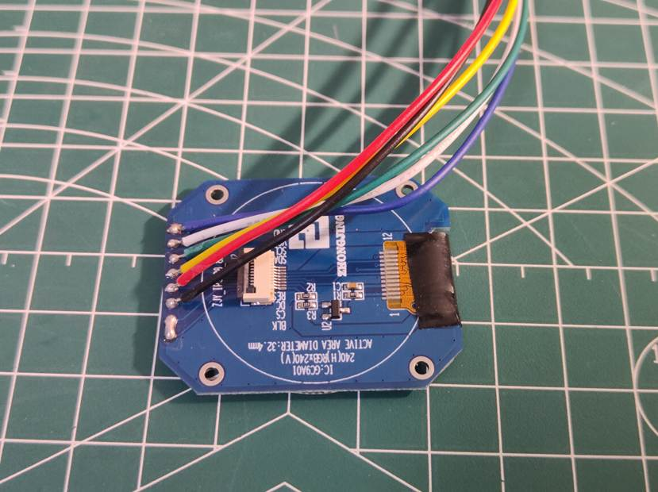
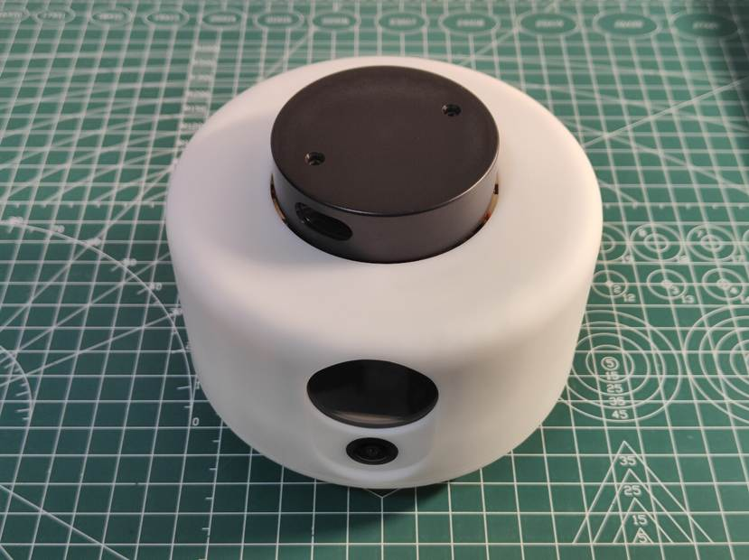

# 一、接口线序

## 1.40Pin接口

| 引脚定义      | 接线定义                               | 引脚定义  | 接线定义                  |
| ------------- | -------------------------------------- | --------- | ------------------------- |
| 3.3V          |                                        | 5V        |                           |
| SDA.2         |                                        | **5V**    | 5V 红色（香橙派电源）     |
| SCL.2         |                                        | **GND**   | GND 黑色（香橙派地线）    |
| PWM15         |                                        | **TXD.2** | RX1红色（香橙派串口发送） |
| GND           |                                        | **RXD.2** | TX1黑色（香橙派串口接收） |
| GPIO3_C6      |                                        | GPIO3_C7  |                           |
| **GPIO4_A0**  | D/C 黑色（液晶屏命令/数据切换）        | GND       |                           |
| **TXD.7**     | RES 红色（液晶屏复位）                 | RXD.7     |                           |
| **3.3V**      | VCC 白色（液晶屏电源）                 | GPIO4_A1  |                           |
| **SPI3_MOSI** | MOSI 金黄色（液晶屏数据）              | GND       |                           |
| **SPI3_MISO** | NC 不接                                | TXD.9     |                           |
| **SPI3_CLK**  | CLK 绿色（液晶屏时钟）                 | SPI3_CS0  |                           |
| **GND**       | GND 蓝色（液晶屏地线）                 | SPI3_CS1  |                           |
| SDA.3         |                                        | SCL.3     |                           |
| **RXD.9**     | RX 黑色（雷达数据）                    | GND       |                           |
| **GPIO3_D4**  | CTL 绿色（雷达控制，M1C1雷达此线无效） | PWM11     |                           |
| GPIO3_D7      |                                        | GND       |                           |
| GPIO3_D0      |                                        | GPIO3_D5  |                           |
| GPIO3_D3      |                                        | GPIO3_D2  |                           |
| GND           |                                        | GPIO3_D1  |                           |

## 2.控制板接口

如上图，左侧的SP、HP、MC分别代表扬声器、耳机、离线语音芯片的麦克风接口；

右侧的5V GND RX1 TX1是香橙派的供电和串口通信接口；

下侧的接口1：5V RX0 TX0 GND，离线语音的烧录接口，点击烧录按钮之后，再接入5V或者重启5V开始烧录（烧录时5V可不接，由电池提供）；

下侧的接口2：- 5V，雷达电源，这里的负极不是直接和GND连通的，需要通过STM32的PB4引脚控制MOS管接通或者断开；

下侧的接口3：G VB，电池输入，连接电池板上的接口；

下侧的接口4：3V3 IO CLK GND，STM32的烧录接口，可以直接烧录，不用断电重启（烧录时3.3V可不接，由电池提供）。

## 3.激光雷达接口

如果电机朝下，从左到右依次是红线、黑线、金黄线、绿线

| 引脚定义 | 功能描述                                                     |
| -------- | ------------------------------------------------------------ |
| 5V       | 红线，5V电源                                                 |
| TX       | 黑线，雷达串口数据线                                         |
| GND      | 金黄线，地线                                                 |
| CTL      | 绿线，雷达转速控制，电压或PWM越高转速越快（对于M1C1雷达来说此线无效或是RX） |

# 二、下壳组装

以下为v1.0外壳组装步骤，v1.1的屏幕和摄像头固定方式略有不同，根据v1.1实际情况组装

1.先给下壳安装**螺母**（下壳12颗螺母，12颗螺丝）

2.准备好电机轮子（2套**电机**+**轮子**+**ZH1.5 6P线**）

3.将电机轮子安装在底盘上，加上**电机固定件**，拧紧**螺丝**

4.安装**万向轮**，用万向轮自带的螺丝拧紧

5.在**底盘驱动板**背面焊接缺失的**XR2981电源芯片**（加热台焊接）

6.背面焊接**开关**和**指示灯**（烙铁焊接）

7.正面依次焊接**CI-03T离线语音芯片**，3个**1.25mm 2P插座**，2个**1.5mm 6P插座**，2个**XH254 2P插座**，1个**XH254 4P插座**（烙铁焊接）

8.背面安装两个**弹簧探针**，用套筒拧紧**防松螺母**

9.将底盘驱动板安装在底盘上，并且接好电机线

10.将**喇叭**的胶布撕下，粘贴在底盘前部

11.将**电池座盒**和**XH254插座**焊接到**电池板**上（加热台和烙铁焊接）

12.将**电池**安装在电池座里

13.将电池板固定在底盘上，用螺丝拧紧

14.先将**32GB EMMC**安装在**香橙派**上，将**散热片**粘贴到CPU上，用四颗**5mm长度自攻螺丝**固定开发板，用两颗**10mm长度自攻螺丝**固定**风扇**，并连接风扇接线

14.根据如下线序制作**耳机线**，先剪掉左声道的接头，只焊接右声道（红线）和地线（黑线），然后安装好**耳机头外壳**

15.将耳机头插在开发板上，注意从左侧缝隙顺出喇叭线，耳机线分别连接到SP，HP接口上，用三颗螺丝固定好开发板

16.连接好**咪头麦克风**，**USB麦克风模块**，开发板**电源线**，**电池连接线**

至此，下壳组装完成

# 三、上壳组装

1.在上壳安装好12颗螺母（要用12颗螺丝）

2.在**屏幕**上焊接**屏幕接线**，并且在FPC上粘贴黑色胶布防止漏光

3.安装屏幕

4.在**USB连接板**上焊接**USB接口**和**1mm插座**（加热台+烙铁焊接）

5.将**广角镜头**替换到**USB模组**上，并且光线传感器的两个引脚短接（烙铁焊接）

6.用**10cm长度线**将USB连接板和相机模组连接好，安装在上壳上，注意这里用10cm长度线应该就足够

7.用4颗螺丝固定好屏幕支架（注意用小螺丝刀）

8.制作如下线序的**雷达转接线**

9.将转接线安装在**雷达**上

10.将雷达安装在上壳上，加上**3个垫片**，用3个螺丝固定

11.将USB线，雷达电源线，雷达信号线，屏幕线连接到底盘上

12.整理好接线，扣上外壳，注意内部线不要在左侧漏出影响美观，扣不住不要使劲压，防止外壳变形，扣好后用底部5颗螺丝固定

至此，全部组装完成

# 四、烧录工具

**STM32烧录器**、**USB串口模块**、**小螺丝刀**、**4根杜邦线装**

