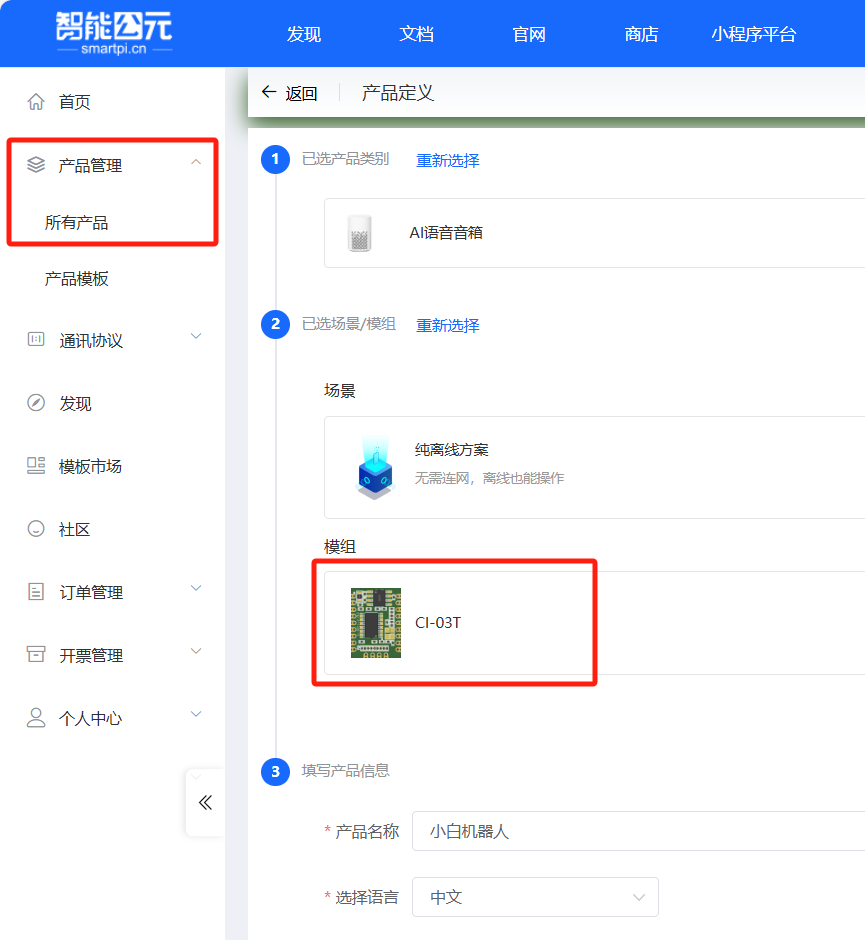
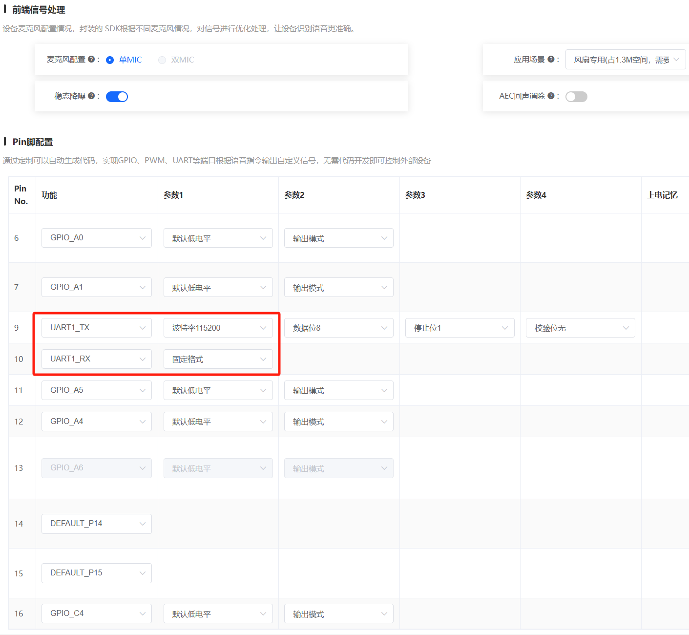
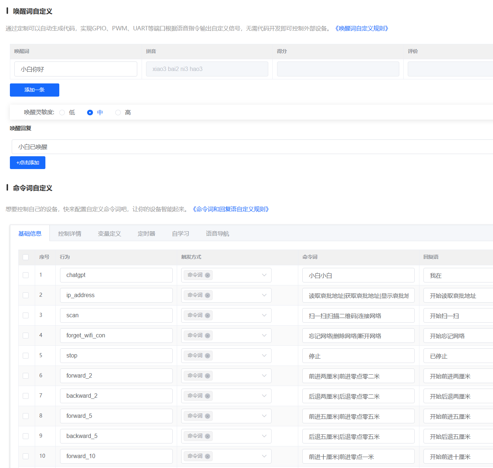
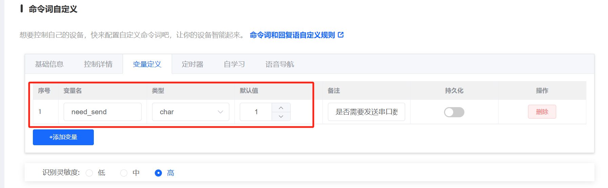
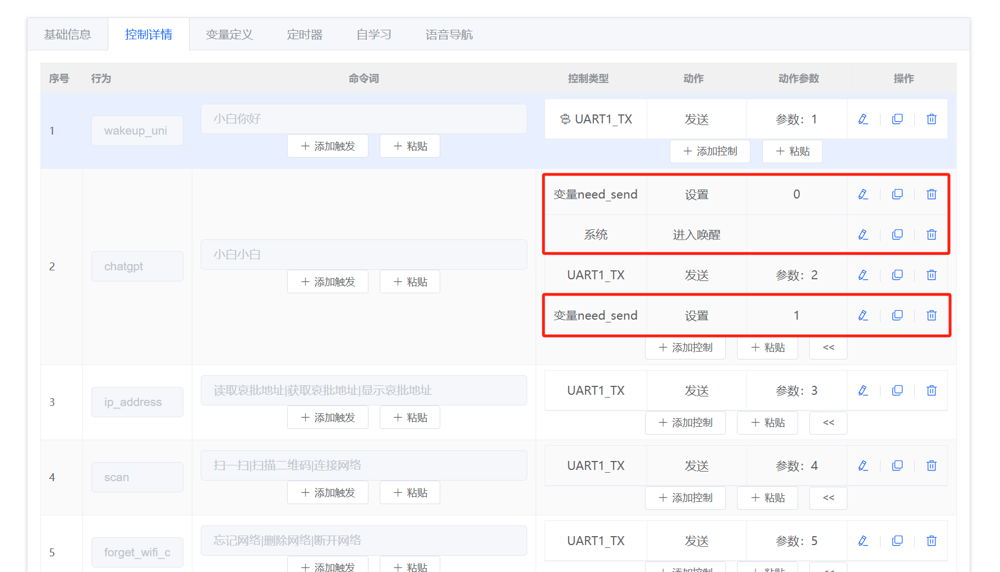
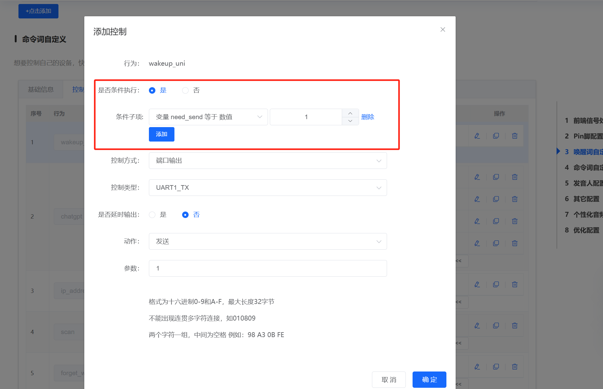
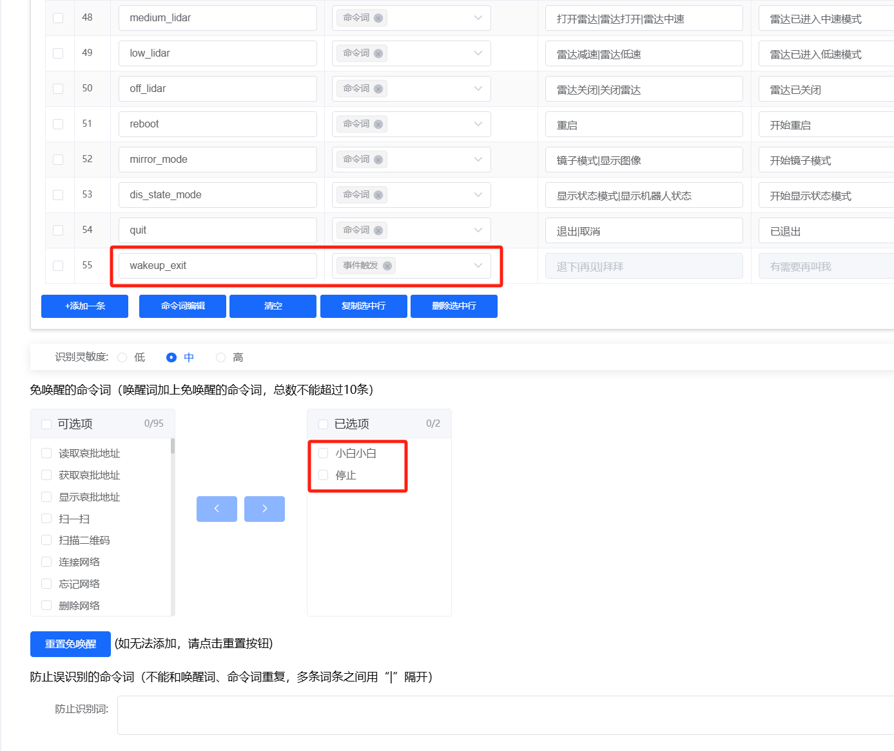
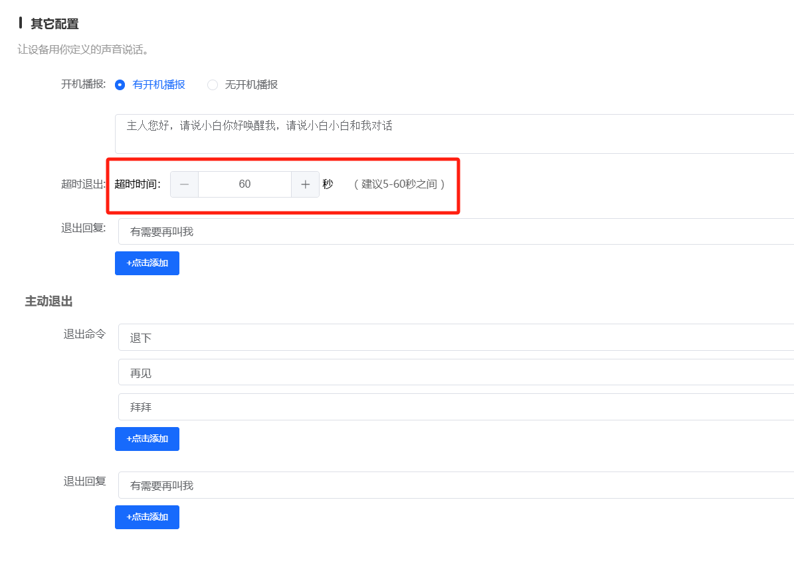

# 一、打开浏览器创建产品

智能公元官网：[智能公元 https://smartpi.cn](https://smartpi.cn)

注册和登录账号之后，点击左侧的产品管理>所有产品>按照下图选择CI-03T作为离线语音芯片，然后创建产品。




# 二、设置串口波特率

离线语音识别结果通过串口发送命令ID给STM32，因此要在引脚配置中打开UART1配置，波特率为115200，其他配置按照下图完成。




# 三、设置唤醒词和命令词

唤醒词和命令词设置如下图，灵敏度目前设置为中，可根据需求选择。

灵敏度中：不易出现误唤醒，但是在有噪音的情况下，比如放音乐的时候难以正常唤醒。

灵敏度高：相对更容易出现误唤醒，但是在有噪音的情况下，也更容易正常唤醒。



点击命令词编辑按钮即可批量输入命令：

```shell
wakeup_uni=小白你好@小白已唤醒
chatgpt=小白小白@我在
ip_address=读取哀批地址|获取哀批地址|显示哀批地址@开始读取哀批地址
scan=扫一扫|扫描二维码|连接网络@开始扫一扫
forget_wifi_con=忘记网络|删除网络|断开网络@开始忘记网络
stop=停止@已停止
forward_2=前进两厘米|前进零点零二米@开始前进两厘米
backward_2=后退两厘米|后退零点零二米@开始后退两厘米
forward_5=前进五厘米|前进零点零五米@开始前进五厘米
backward_5=后退五厘米|后退零点零五米@开始后退五厘米
forward_10=前进十厘米|前进零点一米@开始前进十厘米
backward_10=后退十厘米|后退零点一米@开始后退十厘米
forward_20=前进二十厘米|前进零点二米@开始前进二十厘米
backward_20=后退二十厘米|后退零点二米@开始后退二十厘米
forward_30=前进三十厘米|前进零点三米@开始前进三十厘米
backward_30=后退三十厘米|后退零点三米@开始后退三十厘米
forward_50=前进五十厘米|前进零点五米@开始前进五十厘米
backward_50=后退五十厘米|后退零点五米@开始后退五十厘米
forward_100=前进一百厘米|前进一米@开始前进一米
backward_100=后退一百厘米|后退一米@开始后退一米
left_5=左转五度@开始左转五度
right_5=右转五度@开始右转五度
left_10=左转十度@开始左转十度
right_10=右转十度@开始右转十度
left_20=左转二十度@开始左转二十度
right_20=右转二十度@开始右转二十度
left_30=左转三十度@开始左转三十度
right_30=右转三十度@开始右转三十度
left_45=左转四十五度@开始左转四十五度
right_45=右转四十五度@开始右转四十五度
left_90=左转九十度@开始左转九十度
right_90=右转九十度@开始右转九十度
left_180=左转一百八十度@开始左转一百八十度
right_180=右转一百八十度@开始右转一百八十度
left_360=左转三百六十度@开始左转三百六十度
right_360=右转三百六十度@开始右转三百六十度
voice_up=音量调大|调大音量|增大音量|声音大点@音量已调大
voice_down=音量调小|调小音量|减小音量|声音小点@音量已调小
sing=唱歌|唱首歌@开始唱歌
dance=跳舞|跳个舞@开始跳舞
smile=微笑@哈哈哈
charge=回去充电@开始回去充电
good_night=睡觉|晚安@晚安
good_morning=早上好|早安@早安
photo=拍照|拍张照@三,二,一
tracking_person=跟着我|跟我走@开始跟着你
cancel_tracking=取消跟踪@已取消跟踪
high_lidar=雷达加速|雷达高速@雷达已进入高速模式
medium_lidar=打开雷达|雷达打开|雷达中速@雷达已打开
low_lidar=雷达减速|雷达低速@雷达已进入低速模式
off_lidar=雷达关闭|关闭雷达@雷达已关闭
reboot=重启@开始重启
mirror_mode=镜子模式|显示图像@开始镜子模式
dis_state_mode=显示状态模式|显示机器人状态@开始显示状态模式
quit=退出|取消@已退出
wakeup_exit=退下@有需要再叫我
cur_time=现在几点了|现在时间|当前时间@开始查询时间
weather=今天天气怎么样|今天天气|天气预报@开始查询天气
sound=打开声音|退出静音@已退出静音模式
mute=关闭声音|静音模式@已进入静音模式
open_lcd=打开屏幕@已打开屏幕
close_lcd=关闭屏幕@已关闭屏幕
```


# 四、设置命令词触发后的串口控制

上面的代码在~/newbot_ws/src/wakeup_process/cfg/asr.cfg中也有一份，注意asr.cfg里的命令行号要和下图控制详情中串口发送的参数数值保持一致，因为离线语音芯片只发出来一个数字序号，而没有发送具体是哪个命令，ROS程序会解析asr.cfg中的行号和命令，所以asr.cfg的命令行号要和下图的序号或者发送的参数数字保持一致。

1.先定义一个变量默认为1



2.在“小白小白”触发唤醒前将变量设置为0，再在最后设置为1



3.在“小白你好”的控制代码上加上如下条件执行，防止”小白小白“这个命令连续发01 02两个串口命令



# 五、设置唤醒退出时的事件触发

如果要在唤醒退出时，也发送一条串口命令，则按照下图设置。



并且在控制详情中加上触发参数和串口发送对应的序号，如下图。


# 六、设置超时退出时间




# 七、保存和烧录

点击右上角保存、检查配置、发布版本，然后等待固件生成完成，下载固件，按照烧录资料烧录程序：

[CI-03T烧录资料 http://help.aimachip.com/docs/offline_ci03t/CI_03t_02](http://help.aimachip.com/docs/offline_ci03t/CI_03t_02)

