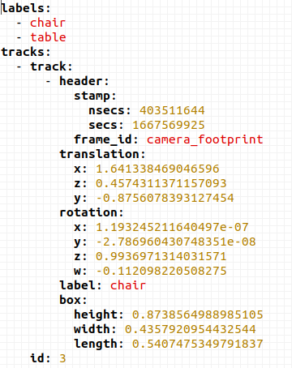

# 标题1

你

## 标题1.1

在

### 标题1.1.1

干嘛

#### 标题1.1.1.1

和和

##### 标题1.1.1.1.1

呵呵呵

###### 标题1.1.1.1.1.1

哈哈哈哈

```python
print("hello word")
```

# 标题2

图片：



# 标题3

https://www.bilibili.com/video/BV1ii421v74Z/

[xixi](xixi) 

https://space.bilibili.com/536218698


