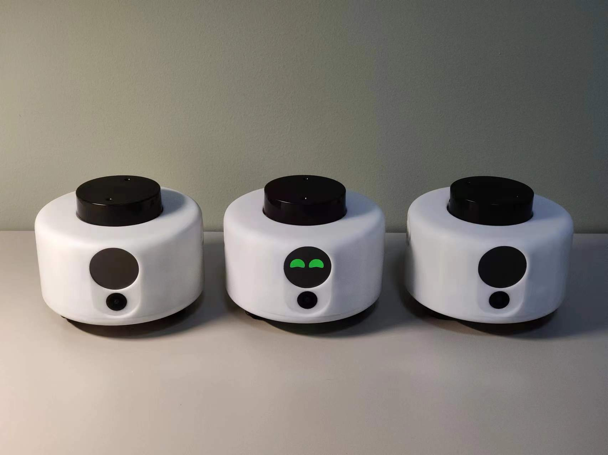

# 小白有什么用

小白机器人主要用于学习和娱乐，学习大模型技术、计算机视觉、ROS机器人编程。

# 硬件规格

| 项目       | 参数                                                         |
| ---------- | ------------------------------------------------------------ |
| 主芯片SOC  | Rockchip RK3566                                              |
| CPU        | 四核64位Cortex-A55，1.8GHz                                   |
| GPU        | • ARM Mali G52 2EE 图形处理器 • 支持 OpenGL ES 1.1/2.0/3.2,OpenCL 2.0,Vulkan 1.1 • 内嵌高性能 2D 加速硬件 |
| NPU        | • 1T算力，支持TensorFlow/ONNX/PyTorch模型转换                |
| VPU        | • 4K@60fps H.265/H.264/VP9 视频解码 • 1080P@60fps H.265/H.264 视频编码 |
| PMU        | Rockchip RK809-5                                             |
| RAM        | LPDDR4 2GB                                                   |
| ROM        | eMMC 32GB                                                    |
| Wi-Fi+蓝牙 | Wi-Fi 5+BT 5.0,BLE(20U5622)                                  |
|            |                                                              |

